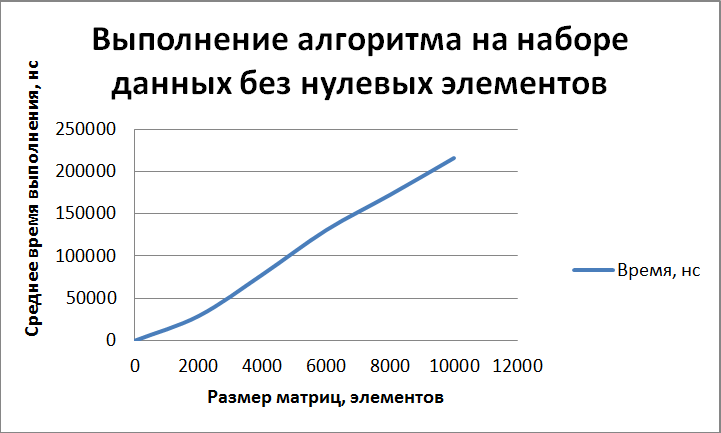

Отчет по лабораторной работе №1
======================================
ИЗУЧЕНИЕ МЕТОДОВ ОЦЕНКИ АЛГОРИТМОВ
--------------------------------------
##### Крицкий Алексей, группа 9б #####
##### Вариант 6 #####
###### 17.09.2019 ######

______________________________________

* ### Цель работы ###

  Изучение методов оценки алгоритмов и программ и определение временной и емкостной сложности типовых алгоритмов и программ

* ### Задания ###

  1. *Знакомство со всеми разделами руководства*

    Со всеми разделами руководства **ознакомился**.

  2. *Получение у преподавателя задания на асимптотическую и верхнюю оценку сложности алгоритма и выполнение этой оценки*

     - Задание **получил**: <blockquote>6. Составить программу, которая формирует матрицу из n*nслучайных чисел. Определить произведение чисел, лежащих на главной диагонали матрицы. Значение n меняется в пределах от 5 до 10 тысяч</blockquote>

    - Алгоритм **разработал**:

    ```java
    long getProductOfDiagonalElements(int[][] matrix) {
        long product = 1;
        for (int i = 0; i < matrix.length; i++) {
            int element = matrix[i][i];
            if (element == 0) {
                return 0;
            }
            product *= element;
        }
        return product;
    }
    ```

    - Оценки

      - Асимптотическая:

        В зависимости от того, как скоро встретится нулевой элемент на диагонали, зависит скорость выполнения задачи данным алгоритмом.

        1. Худший случай

          Это когда все элементы на диагонали ненулевые:

          **Θ{х}(n) =** 1 + f{цикл} = 1 + (1 + 3n + nf{тело}) = 1 + (1 + 3n + n(2 + 2 + 1 + 1 + 1 + 1)) = 2 + 3n + 8n = **11n + 2**.

        2. Лучший случай

          Это когда левый верхний элемент матрицы нулевой:

          **Θ{л}(n) =** 1 + f{цикл} = 1 + (1 + 3 + f{тело}) = 1 + (1 + 3 + (2 + 2 + 1 + 1 + 1 + 1)) = **13**.

        3. Средний случай

          Прерывание цикла происходить при встрече первого нулевого элемента на диагонали. Вероятность встретить на k-ом шаге нуль зависит от границ генерирования значений для матриц.

          Положем, что элемент матрицы может иметь любое целочисленное значение в промежутке [a, b].

          Вероятность того, что на шаге k встретится нулевой элемент, равна 1 / (b - a + 1).  

      - Верхняя:

        Из худшего случая => **O(n)**

  3. *Оценка экспериментальным способом времени выполнения того же алгоритма. Значения исходных данных необходимо задавать в начале работы программы с помощью генератора случайных чисел, причем делать это до начала измерения времени работы алгоритма. Сам алгоритм в ходе измерений должен выполняться в цикле несколько миллионов раз, чтобы он не заканчивал работу слишком быстро, а выполнялся хотя бы несколько секунд.*

    **Код**:
    ```java
    // generation random matrices
    int[][] matrix = creator.createRandom(currentSize);

    long start = System.nanoTime(); // start experiment
    for (int j = 0; j < ITERATION_NUMBER; j++) {
        long result = SquareMatrixOperations.getProductOfDiagonalElements(matrix);
    }
    long end = System.nanoTime(); // end experiment
    ```

  4. *Измерения необходимо повторить пять раз для различного объема исходных данных. Количество повторений алгоритма в каждом измерении должно быть одинаковым.*

    **Код**:
    ```java
      int sizeStep = (MAX_SIZE - MIN_SIZE) / (SIZE_SAMPLE_NUMBER - 1);
      int currentSize = MIN_SIZE;
      SquareMatrixCreator creator = new SquareMatrixCreator(MIN_VALUE, MAX_VALUE);
      for (int i = 0; i < SIZE_SAMPLE_NUMBER; i++) {
          // generation random matrices
          int[][] matrix = creator.createRandom(currentSize);

          long start = System.nanoTime(); // start experiment
          for (int j = 0; j < ITERATION_NUMBER; j++) {
              long result = SquareMatrixOperations.getProductOfDiagonalElements(matrix);
          }
          long end = System.nanoTime(); // end experiment

          System.out.println(String.format("Среднее время работы алгоритма для матрицы " +
                          "размера %dx%d: %d наносекунд",
                  currentSize, currentSize, (end - start) / ITERATION_NUMBER));
          currentSize += sizeStep;
      }
    ```

  5. *Построить график зависимости времени выполнения от объема входных данных.*

    Работа алгоритма:
    

* ### Вывод ###

  Теоретические оценки производительности алгоритма согласовываются с экспериментальными.
