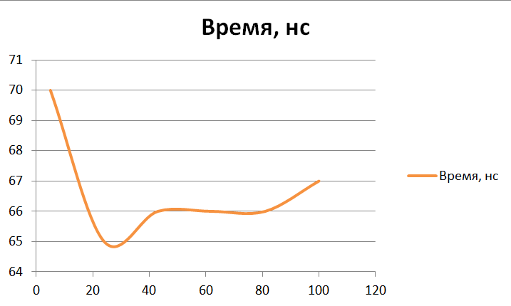

Отчет по лабораторной работе №2
======================================
ИССЛЕДОВАНИЕ И ОЦЕНКА АЛГОРИТМОВ ПОИСКА
--------------------------------------
##### Крицкий Алексей, группа 9б #####
##### Вариант 6 #####
###### 26.09.2019 ######

______________________________________

* ### Цель работы ###

  Разработка программ, реализующих различные алгоритмы поиска, и оценка их временной и пространственной сложности.

* ### Задания ###

  1. *Знакомство со всеми разделами руководства*

    Со всеми разделами руководства **ознакомился**.

  2. *Получение у преподавателя задания на разработку программы для алгоритмов поиска*

     Задание **получил**: <blockquote>6. Разработать алгоритм и программу **интерполирующего поиска**. В качестве исходных данных использовать массив целых чисел, который формируется с помощью датчика случайных чисел с диапазоном **от 0 до 100**. Аргумент поиска – число.</blockquote>

  3. *Разработка и отладка заданной программы*

    - Словесное описание заданного алгоритма поиска

      0. Входные аргументы:
        - отсорированный по возрастанию массив целых чисел **sortedNumbers** (sortedNumbers.length - размер массива);
        - целое число **number**;
      1. Инициализация переменных:
        - **leftBoarder** = 0 - левая граница;
        - **rightBoarder** = n-1 - правая граница;
      2. **Цикл**: пока sortedNumbers[leftBoarder] < number и sortedNumbers[rightBoarder] > number
        + выбор текущего элемента **middle**: middle = leftBoarder + (number - leftBoarderNumber) * (rightBoarder - leftBoarder) / (rightBoarderNumber - leftBoarderNumber)
        + Если sortedNumbers[middle] > number:

          - leftBoarder = middle + 1

        + иначе:

          - Если middleNumber < number:

            * Если middle > 0:

              rightBoarder = middle - 1

            * иначе

              ответ 0.

          - иначе:

            ответ middle.

      3. Последние условия

        + Если sortedNumbers[leftBoarder] == number:

          * ответ leftBoarder.

        иначе:

          * Если sortedNumbers[rightBoarder] == number:

            - ответ rightBoarder.

          * иначе:

            - ответ "ответ не найден".

    - Текст программы

      ```java
      int indexOf(final int[] sortedNumbers, int number) {
          int leftBoarder = 0;
          int rightBoarder = sortedNumbers.length - 1;
          int middle;
          int leftBoarderNumber;
          int rightBoarderNumber;
          while ((leftBoarderNumber = sortedNumbers[leftBoarder]) < number
                  && (rightBoarderNumber = sortedNumbers[rightBoarder]) > number) {
              middle = leftBoarder + (number - leftBoarderNumber) * (rightBoarder - leftBoarder)
                      / (rightBoarderNumber - leftBoarderNumber);
              int middleNumber = sortedNumbers[middle];
              if (middleNumber > number) {
                  leftBoarder = middle + 1;
              } else if (middleNumber < number) {
                  if (middle > 0) {
                      rightBoarder = middle - 1;
                  } else {
                      rightBoarder = 0;
                      break;
                  }
              } else {
                  return middle;
              }
          }
          if (sortedNumbers[leftBoarder] == number) {
              return leftBoarder;
          } else if (sortedNumbers[rightBoarder] == number) {
              return rightBoarder;
          } else {
              return -1;
          }
      }
      ```

  4. *Получение верхней и экспериментальной оценки времени выполнения заданного алгоритма и программы*

    + Верхняя оценка времени выполнения

      Пусть n - размер подаваемого массива.

      - Хучший случай

        Это когда, например, значения элементов **экспоненциально** возрастают. В таком случае линейная интерполяция не даст никакого полезного предсказания, поскольку элемент не предсказанной позиции будет почти всегда меньше искомого, пока размер рассматриваемого диапазона не станет достаточно малым. Т.е. в таком случае может быть выполнено n итераций, и тогда:

        **Θ{х}(n) =** 2 + f{цикл} + f{условие} = 2 + ((4 + 1 + 4)n + nf{тело}) + 3 = 5 + (9n + n(3 + f{условие1})) = 5 + (11n + n(2f{условие1.1})) = 5 + (11n + 2n(2)) = **15n + 5**.

      - Лучший случайных

        Это когда когда, например, последовательность чисел в массиве **линейно** возрастает и искомый элемент присутствует. В таком случае предсказание может дать точный результат с первой итерации:

        **Θ{л}(n) =** 2 + f{цикл} + f{условие} = 2 + ((4 + 1 + 4) + f{тело}) + 3 = 5 + (9 + (3 + f{условие1})) = 5 + (11 + 2) = **17**.

      - Средний случай

        Согласно поставленным в задаче условиям, вероятность того, что на расматриваемой позиции массива находится искомый элемент, составляет 1/100, а вероятность того, что в массиве содержится искомый элемент, составляет n/100.

        Рассматриваемый алгоритм является модернизацией алгоритма двоичного поиска, поэтому его временная сложность в среднем не превышает O(log(n)). Кроме того, при линейной интерполяции среднего элемента рассматриваемого диапазона массива отсекает на очередной итерации не половину диапазона постоянно. Чем больше рассматриваемый диапазон, чем большая его доля отбрасывается, и эта зависимость логарифмическая. 

        Таким образом, в средним случае **Θ{ср}(n) =** **O(log(log(n)))**

      - Итого

        * **O(n)** (в худшем случае)
        * **O(log(log(n)))** (в среднем)

    + Экспериментальная оценка времени выполнения

      Результат получения экспериментальной оценки временной работы алгоритма для различного размера входных данных представлен на графике.

      

      Видно, что среднее время выполнения возрастает очень медленно, что согласуется с теоретической верхней оценкой. Пик на малом размере входных данных обучловлен большой вероятностью того, что массив не будет содержать искомого числа, что является одним из плохих случаев для данного алгоритма поиска.

  5. *Нахождение предельной оценки емкости памяти, необходимой для выполнения разработанной программы*

    Программа реализации алгоритма интерполяционного поиска при своей работе выделяет дополнительно память только под константное число переменных, поэтому предельная оценка емкостной сложности алгоритма составляет **O(n)** (размер подающегося на вход массива).

* ### Вывод ###

  Разработал программу, реализующию один из алгоритмов поиска, а также сделал оценку его временной и пространственной сложности.
