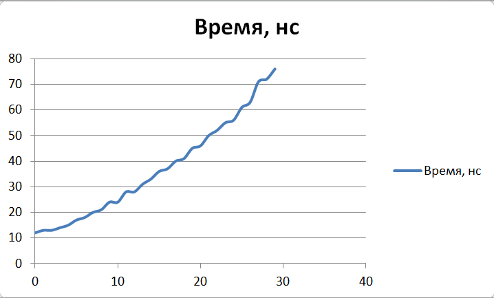

Отчет по лабораторной работе №3
======================================
ИЗУЧЕНИЕ МЕТОДОВ ОЦЕНКИ АЛГОРИТМОВ
--------------------------------------
##### Крицкий Алексей, группа 9б #####
##### Вариант 6 #####
###### 03.10.2019 ######

______________________________________

* ### Цель работы ###

  Разработка программ, реализующих различные рекурсивные алгоритмы, и оценка их временной и пространственной сложности

* ### Задания ###

  1. *Знакомство со всеми разделами руководства*

    Со всеми разделами руководства **ознакомился**.

  2. *Получение у преподавателя задания на разработку программы для рекурсивных алгоритмов*

     Задание **получил**: <blockquote>*Разработать следующие алгоритмы и программы с использованием рекурсии*: 6. Вычисления целой степени вещественного числа.</blockquote>

  3. *Разработка и отладка заданной программы.*
    - Словестный алгоритм:
      функция power (чисто number, целая степень degree)

      + Если degree > 1:

        Вызов и возврат power(number, degree - 1) * number.

      + Иначе если degree = 1:

        Возврат number.

      + Иначе если degree = 0:

        возврат 1.

      + Иначе введенная степень некоррекна.

      Таким образом, с помощью рекурсии происходит имитация цикла по degree перемножения чисел number.

    - Программу **разработал и отладил**:
      ```java
      double power(double number, int degree) {
          if (degree > 1) {
              return power(number, degree - 1) * number;
          } else if (degree == 1) {
              return number;
          } else if (degree == 0) {
              return 1;
          } else {
              throw new ArithmeticException("Negative degree is not available");
          }
      }
      ```

  4. *Получение верхней и экспериментальной оценки времени
выполнения заданного алгоритма и программы.*

  - Верхняя оценка

    Глубина рекурсии зависит напрямую и только от величины возводимой степени.
    На очередном шаге рекурсии основной операцией является умножение чисел.
    Таким образом:

    **T(p) =** С * p = **O(p)**, где p - возводимая степень.

  - Экспериментальная оценка

    ```java
    for (int currentPower = MIN_POWER; currentPower < MAX_POWER; currentPower++) {
        long commonTime = 0;
        long start = System.nanoTime(); // start experiment
        for (int j = 0; j <= ITERATION_NUMBER; j++) {
            double number = generateDouble(MIN_VALUE, MAX_VALUE);
            double result = MathOperations.power(number, currentPower);
        }
        long end = System.nanoTime(); // end experiment
        commonTime += (end - start);
        System.out.println(String.format(OUTPUT_MESSAGE,
                currentPower,
                commonTime / ITERATION_NUMBER));
    }
    ```

    

  5. *Нахождение предельной оценки емкости памяти, необходимой
для выполнения разработанной программы.*

    Проведя аналогичные рассуждения, получим:

    **M(p) =** С * p = **O(p)**, где p - возводимая степень.

* ### Вывод ###

  Теоретические оценки производительности алгоритма согласовываются с экспериментальными. Рекурсивные алгоритмы имеют более наглядный принцип работы, однако, как правило, уступает по временной или емкостной сложности алгоритмам, реализованным с помощью циклов.
