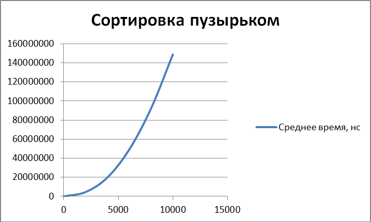
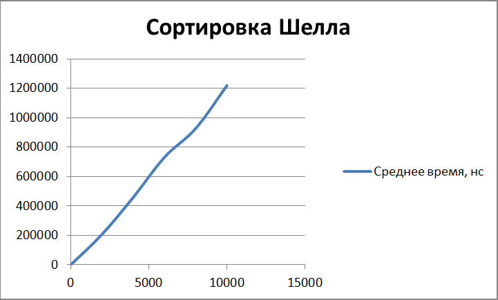

Отчет по лабораторной работе №4
======================================
ИССЛЕДОВАНИЕ И ОЦЕНКА АЛГОРИТМОВ СОРТИРОВКИ
--------------------------------------
##### Крицкий Алексей, группа 9б #####
##### Вариант 6 #####
###### 10.10.2019 ######

______________________________________

* ### Цель работы ###

  Разработка программ, реализующих различные алгоритмы сортировки, и оценка их временной и пространственной сложности.

* ### Задания ###

  1. *Знакомство со всеми разделами руководства*

    Со всеми разделами руководства **ознакомился**.

  2. *Получение у преподавателя задания на разработку программы для алгоритмов сортировки*

    Задание **получил**: <blockquote>6. Составить две программы, которые реализуют алгоритмы
простой сортировки «пузырьком» и сортировки Шелла. Исходные
данные задавать с помощью датчика случайных чисел</blockquote>

  3. *Разработка и отладка заданных программ*

    **Разработал и отладил** заданные программы:

    - Простая сортировка пузырьком:

      При упорядочении выполняются следующие операции:

      1. элементы массива сравниваются попарно: первое со вторым; второе с третьим; i-тое – с (i+1)-вым;

      2. если они стоят неправильно (при упорядочении по возрастанию первый должен быть меньше второго или равен ему), то элементы меняются местами.

      За один такой просмотр массива при сортировке по возрастанию минимальный элемент «вытолкнется», по крайней мере, на одно место вверх (вперед), а максимальный – переместится в самый конец (вниз). Таким образом, минимальный элемент как легкий пузырек воздуха в жидкости постепенно «всплывает» вверх (в начало последовательности). Отсюда – название метода.

      Поскольку последний элемент после первого просмотра массива окажется на своем месте, следующий просмотр можно закончить раньше, т.е. в конце сравнивать (n-2)-рой и (n-1)-вый элементы. Вообще, при k-том просмотре достаточно сравнить элементы от первого до (n-k) –того.

      За n-1 просмотр произойдет полное упорядочение массива при любом исходном расположении элементов в нем.

      ```java
      sort(int[] array) {
          int tmp;
          for (int i = 0; i < array.length - 1; i++) {
              for (int j = 0; j < array.length - i - 1; j++) {
                  if (array[j] > array[j+1]) {
                    tmp = array[j];
                    array[j] = array[j+1];
                    array[j+1] = tmp;
                  }
              }
          }
      }
      ```

    - Cортировка Шелла:

      Метод является ускоренным вариантом сортировки вставками. При этом ускорение достигается за счет увеличения расстояния, на которое перемещаются элементы. Исходный массив делится на d частей, содержащих n / d элементов каждый (последний подмассив может быть короче). Подмассивы содержат элементы с номерами [0, d, 2 d и т.д.], [1, d +1, 2 d +1 и т.д.], [2, d + 2, 2 d +2 и т.д.] и т.д.

      Вначале сравниваются и упорядочиваются с помощью алгоритма вставок элементы, отстоящие один от другого на расстоянии d, т.е. имеющие номера 0 и 1, d и d + 1, 2 d и 2 d + 1 и т.д. Затем процедура повторяется при меньших значениях d, например, d / 2. Завершается  алгоритм упорядочением элементов при d = 1, то есть обычной 46 сортировкой вставками. Мы рассмотрим сортировку Шелла для начального значения d, равного n /2, и будем последовательно уменьшать его вдвое.

      ```java
        sort(int[] array) {
          for (int inc = array.length / 2; inc > 0; inc = inc / 2) {
            for (int step = 0; step < inc; step++)
                insertionSort(array, step, inc);
            }
        }
        ...
        void insertionSort(int[] array, int start, int inc)  {
            int tmp;
            for (int i = start; i < array.length - 1; i += inc) {
                for (int j = Math.min(i + inc, array.length - 1); j >= inc; j -= inc) {
                    if (array[j - inc] > array[j]) {
                        tmp = array[j];
                        array[j] = array[j - inc];
                        array[j - inc] = tmp;
                    } else {
                        break;
                    }
                }
            }
        }
      ```

  4. *Получение верхней и экспериментальной оценки времени выполнения заданных алгоритмов и программ.*

    Пусть n - размер входного массива.

    - Простая сортировка пузырьком:

      + Верхняя оценка

        На i-ом шаге алгоритма "железно" происходит n - i сравнений. Итого:

        **T(n) =** C*( (n-1) + (n-2) + ... + (n-(n-1)) ) = C*( n(n-1) - (1 + 2 + ... + n-1) ) = C*( n(n-1) - (1 + n-1) * (n-1)/2 ) = C*( n(n-1) - n(n-1)/2 ) = **C*(n(n-2)/2)**

        => **O(n(n-1)/2) = O(n^2)**

      + Экспериментальная оценка

        

    - Cортировка Шелла:

      + Верхняя оценка

        Эффективность алгоритма зависит от выбранных длин промежутков. В данном случае рассматривается деление на 2.

        Поскольку на каждой итерации размер промежутков сокращается в два раза, то внешний цикл пройдет log(n) итераций. На inc-ой итерации рассматривается n/inc элементов в шаге. Далее с методом сортировки вставками элементы по очереди продвигаются в начало, учитывая, что передняя часть, где элементы меньше текущего элемента, уже упорядочена надлежащим образом.

        Временная сложность сортировки вставками составляет *O(n^2)*, но постепенно этапы сортировки вставками будут иметь все меньше и меньше итераций, поскольку на предыдущих шагах элементы уже поставились на свои места.

        Следовательно, **T(n) = O(n^2)** - в худшем случае. Однако в среднем она может составлять **O(n*log(n))**, а в лучшем даже **O(n)**.

      + Экспериментальная оценка

        

  5. *Нахождение предельной оценки емкости памяти, необходимой для выполнения разработанных программ*

    - Простая сортировка пузырьком:

      Алгоритм не выделяет дополнительной память для элементов массива (кроме tmp для swap):

      **M(n) = O(1)**

    - Cортировка Шелла:

      Алгоритм не выделяет дополнительной память для элементов массива (кроме tmp для swap):

      **M(n) = O(1)**

* ### Вывод ###

  Сортировка пузырьком - никуда не пригодный алгоритм.
  Сортировка Шелла во многих случаях медленнее, чем быстрая сортировка, однако она имеет ряд преимуществ:

  - отсутствие потребности в памяти под стек;
  - отсутствие деградации при неудачных наборах данных — быстрая сортировка легко деградирует до O(n*n), что хуже, чем худшее гарантированное время для сортировки Шелла.
